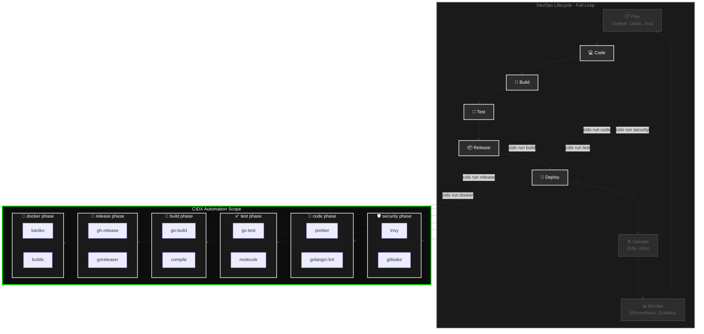
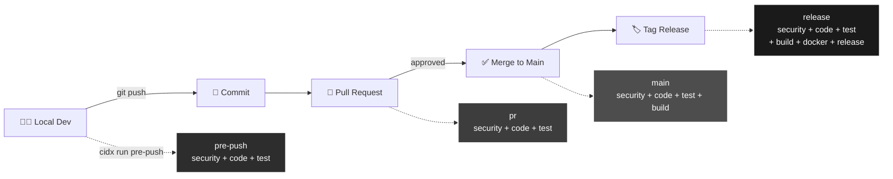
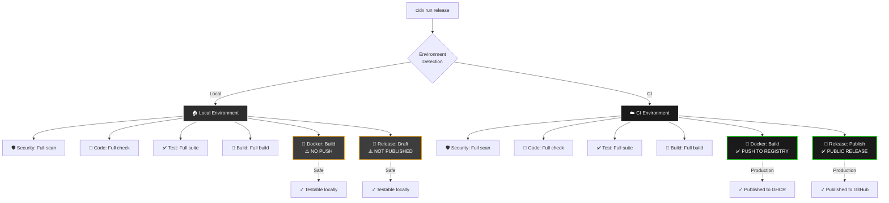
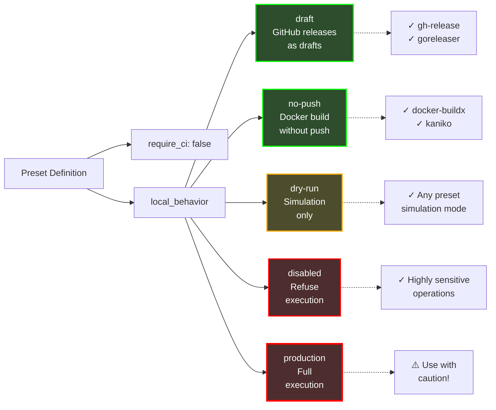
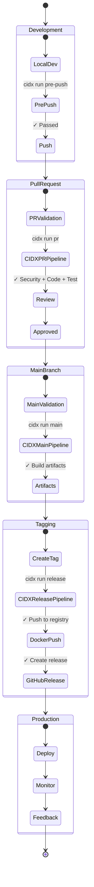
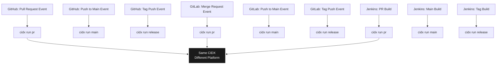

# CIDX & DevOps Integration

This document explains how CIDX integrates into standard DevOps workflows and product lifecycle.

## Philosophy: DevOps Loop & CIDX Phases

The **DevOps loop** is a **logical representation** of the software lifecycle, not a strict linear process. It helps conceptualize the continuous flow from planning to monitoring and back to planning.

**CIDX scope**: CIDX is a **CI/CD automation platform** that covers the technical pipeline from code to deployment. It does **NOT** cover:

- **PLAN** → Product management tools (Jira, Linear, roadmaps)
- **OPERATE** → Production operations (Kubernetes, orchestration)
- **MONITOR** → Observability (Prometheus, Grafana, logs)

**CIDX covers**: CODE → BUILD → RELEASE → DEPLOY

At each covered stage, **CIDX phases** provide automated quality gates and validations that can be executed anywhere (local, CI, any platform).

## 1. CIDX in the DevOps Loop

**Phase Mapping Logic**:

**CIDX covers (CI/CD automation)**:

- **CODE** → Security scanning + Code quality (shift-left approach)
- **BUILD** → Testing + Compilation (validate before release)
- **RELEASE** → Create GitHub release with artifacts (tag, notes, binaries)
- **DEPLOY** → Build and push Docker images (deployment-ready containers)

**Out of CIDX scope**:

- **PLAN** → Product management, roadmaps, user stories (Jira, Linear, etc.)
- **OPERATE** → Production operations, infrastructure management (Kubernetes, Terraform, etc.)
- **MONITOR** → Observability, metrics, logs, alerting (Prometheus, Grafana, DataDog, etc.)

For CIDX itself: once the GitHub release is created, the Docker phase builds and pushes the `cidx` container image to registries (GHCR, Docker Hub), making it deployable anywhere.

## 2. Git Workflow & CIDX Pipelines

## 3. Environment-Based Execution

## 4. Security Modes Detail

## 5. Complete Product Lifecycle

## 6. CI/CD Platform Integration

## Key Principles

1. **Convention over Configuration**: CIDX knows what to do based on environment
2. **Safe by Default**: Sensitive operations protected in local environments
3. **Consistent Everywhere**: Same commands work on local, GitHub, GitLab, Jenkins
4. **Product Lifecycle Aware**: Different pipelines for different stages
5. **Testable Locally**: Full pipeline testable without publishing

## Benefits

- ✅ **Developers**: Test release process locally without risk
- ✅ **CI/CD**: Simplified configuration (just call CIDX)
- ✅ **Security**: Protected against accidental production publishes
- ✅ **Portability**: Switch CI platforms without changing CIDX config
- ✅ **Clarity**: Clear separation between development stages
