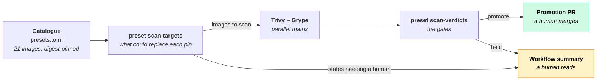
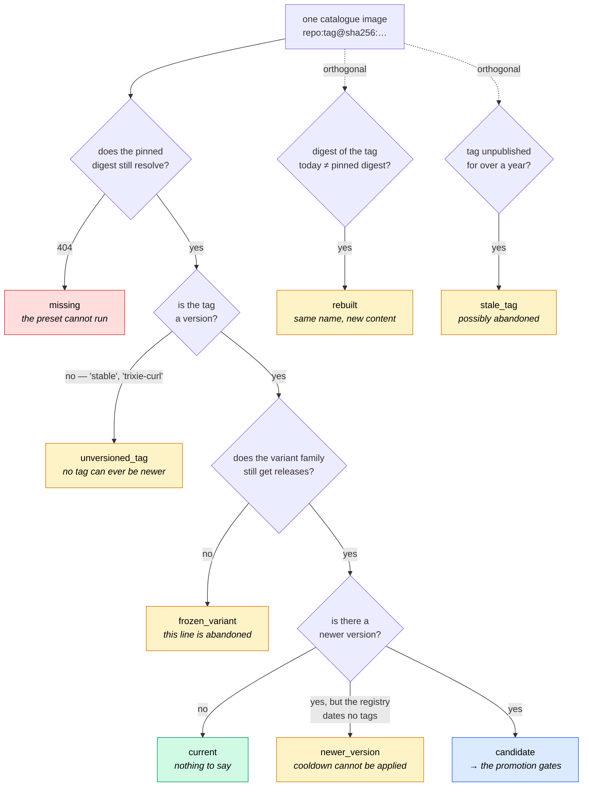
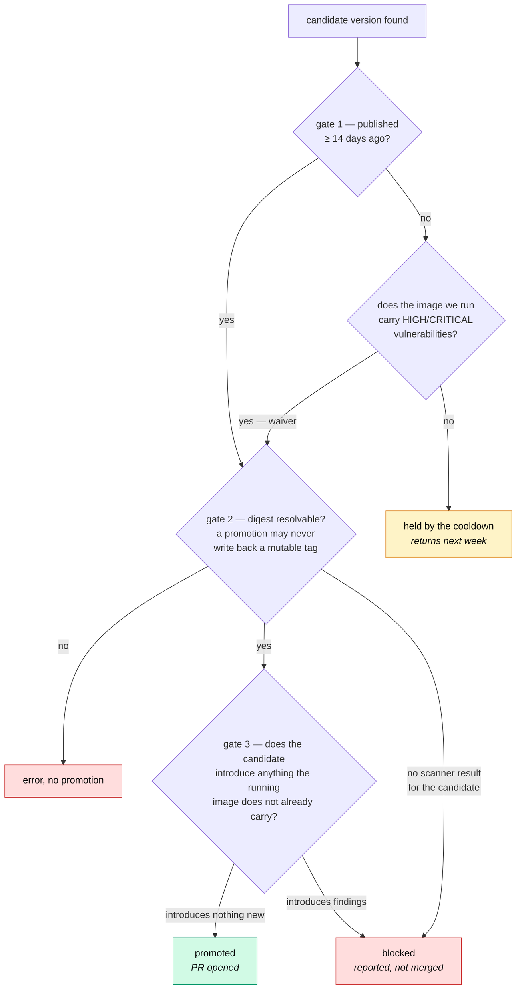
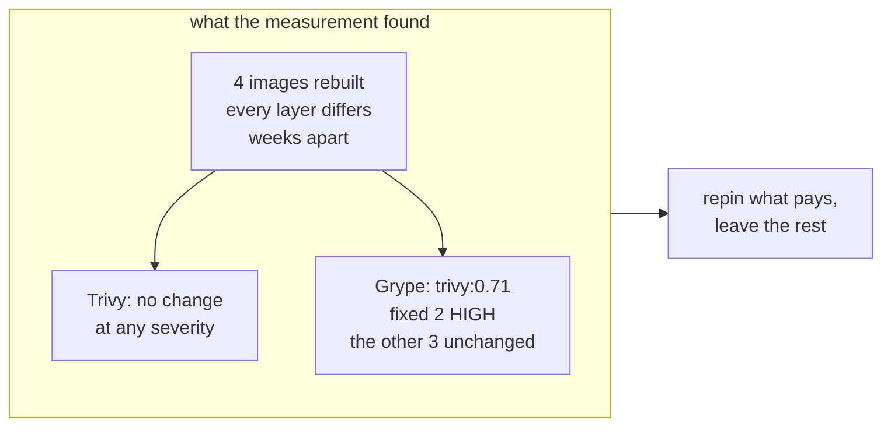
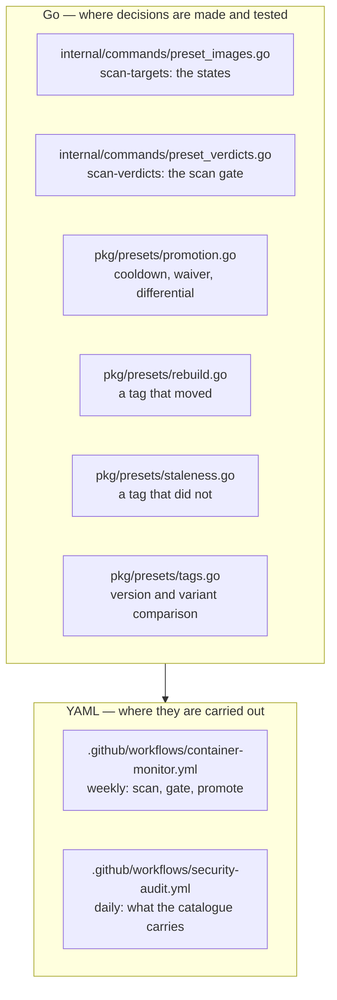

# The image supply chain, in diagrams

CIDX ships a catalogue of container images and decides, every week and without a human, which of them may be replaced. This page is the map of that machinery: what runs, in what order, what each signal means, and — the part that took the longest to learn — what each signal is _worth_.

The prose, the incidents behind each rule and the arguments for them live in [Security & Environments → Supply-Chain Policy](security.md#supply-chain-policy). This page is the shape.

## The one-sentence version

Every image is pinned by digest, so nothing upstream can reach the catalogue by accident; a weekly job then asks what _could_ replace each pin, puts the answer in front of two independent scanners, and opens a pull request only for the replacements that survive every gate. The scanners are pinned by digest too — they are the gate, so nothing about them may be mutable either.

Two exits, and the difference between them is the whole design. The top exit changes the catalogue automatically. The bottom one produces a line for someone to read. **A signal that cannot be acted on automatically is not a failure of the design — it is most of it.**

## What `scan-targets` decides, image by image

For each distinct image in the catalogue, one pass answers three independent questions: is the pin still valid, what could replace it, and is anything else worth knowing.

The two dotted branches are **orthogonal on purpose**. Everything in the main chain compares tag _names_; an image can sit at the head of its family, on a version nothing supersedes, and still be abandoned (`stale_tag`) or already replaced under the same name (`rebuilt`). Asking those questions inside the chain would mean never asking them of the images that look healthy — which are exactly the images that need asking.

## The gates a candidate must clear

A newer version is not a promotion. It has to survive three of them.

Four properties are worth naming, because each was learned the hard way:

- **The cooldown has an exception.** Fourteen days of soak is the right default, and it is the wrong default when the image we run today is knowingly vulnerable — then waiting is the risk. The waiver reads the vulnerabilities already recorded against the running image, so it costs no extra scan.
- **The scan gate is differential.** Not "is the candidate clean" — several catalogue images have never been clean — but "does the candidate introduce anything the running image does not already carry". An absolute gate froze every promotion for months.
- **Missing evidence is never a pass — but "missing" means two different things.** With no scanner result for the _candidate_, there is nothing to judge and it is held: a promotion needs positive evidence, not the absence of bad news. With no same-day result for the _image we already run_, the comparison still happens, against the acceptances file alone. That is the **stricter** verdict, not a lenient one: the running image's findings are what _excuse_ a finding on the candidate, so a narrower baseline makes promotion harder. Fail-closed here means never widening the excuse set on an assumption.
- **A promotion may rest on one scanner.** Trivy and Grype both run; when only one returns a result, the other's silence is a failed pull, not a clean image. Holding every promotion on that would rebuild the permanently-stuck gate the differential verdict replaced — so the verdict proceeds and records which scanners actually backed it, and the promotion PR names the versions cleared by only one. That is the honest version of "scanned twice", and it is the shape of the mistake in the section below.

## The states, and who is expected to act

| state              | meaning                                      | surfaces as     | who acts               |
| ------------------ | -------------------------------------------- | --------------- | ---------------------- |
| `missing`          | pinned reference is gone upstream            | ❌ error, fails | a human, urgently      |
| `rebuilt`          | tag resolves to a different digest           | ⚠️ warning      | a human, when it pays  |
| `frozen_variant`   | the variant line gets no more releases       | ⚠️ warning      | a human, a repin       |
| `unversioned_tag`  | tag is a name, so nothing can be newer       | 📋 listed       | nobody — it is a fact  |
| `stale_tag`        | not republished in over a year               | 📋 listed       | a human, investigation |
| `newer_version`    | newer exists, registry dates nothing         | 📋 listed       | a human, a repin       |
| candidate promoted | cleared every gate                           | 🔀 pull request | a human merges         |
| candidate held     | cooldown, or the scan gate                   | 📋 listed       | nobody — it returns    |
| `current`          | nothing newer, nothing moved, nothing to say | 📋 listed       | nobody                 |

**Warning versus listed is a real distinction, not decoration.** A signal is annotated when an action clears it, and merely listed when no action can. `unversioned_tag` will be true of `shellcheck:stable` for as long as it is pinned there — annotating it would produce a weekly alarm that never resolves, which is an alarm nobody reads. `rebuilt` is cleared by a repin, so it is annotated.

## What the pin costs, and how that was measured

Digest pinning makes the promise that what runs is what was reviewed. Its cost is symmetrical: **nothing upstream can reach us, including the things we want.** For a tag carrying no version, rebuilds under the same tag are the _only_ update channel there is; for a versioned tag, they carry whatever changed that the version does not name.

The `rebuilt` signal detects that. It deliberately does **not** adopt it — adopting a new digest on an unchanged tag is the exact substitution digest pinning exists to refuse, and no scanner sees a backdoor that carries no CVE.

The first run of that signal found five moved digests, four of them hardened images on versioned tags. They were measured before any decision was taken, old digest against new:

Two lessons came out of that, and they are the reason this page exists.

**One scanner is not the measurement.** The first pass used Trivy alone and concluded that all four rebuilds carried nothing. Grype, run afterwards on the same eight images, found that the `trivy:0.71` rebuild had fixed two HIGH findings — `GHSA-hrxh-6v49-42gf` in `google.golang.org/grpc` and `GO-2026-5970` in `golang.org/x/text` — that Trivy never reported. The weekly job has always run both and taken the union, for exactly this reason; the ad-hoc measurement did not, and reached a wrong conclusion.

**A signal that often has nothing to say still earns its place.** Three of the four rebuilds genuinely carried no vulnerability change at any severity, under either scanner. That is the argument _for_ reporting rather than adopting, not against detecting: had `rebuilt` been wired to automatic promotion, three of those four would have spent the pin's guarantee on unreviewed content for no measurable gain — and the fourth would have been indistinguishable from them until someone measured.

## The tools are part of the supply chain too

For a long time the policy governed the images it inspected and not the ones doing the inspecting. `container-monitor.yml` and `security-audit.yml` ran `aquasec/trivy:latest` and `anchore/grype:latest` — ten invocations, none pinned — with the runner's docker config mounted so each container could read the DHI credentials.

The credentials are the smaller half. **These containers _are_ the gate.** A scanner that reported "no findings" would clear every candidate in the catalogue, and the differential verdict, the cooldown and the acceptances file would all agree with it, because none of them has any other source of truth about what an image carries. The entire policy rested on two references pinned by nothing.

Both are now pinned by digest in a workflow-level `env:`, and the same reasoning covers `pip install commitizen`, which runs in the job that rewrites `presets.toml` and opens the pull request. `TestWorkflowToolsArePinned` fails on a workflow that runs an unpinned image or installs an unversioned package.

The first version of that guard matched the image only at the end of a line, and so missed every Trivy invocation — `docker run … aquasec/trivy:latest image \` puts the reference mid-line. It was caught by reverting the fix and watching the guard stay green on half the bug. **A guard that sees part of a defect is worse than none, because it reports green.**

## Where each piece lives

The split is deliberate and it is a rule: **every decision lives in Go, where it is tested; the workflow reads a verdict and never computes one.** A gate written in `jq` inside a YAML step is a gate nobody can write a failing test for, and this repository has twice shipped one that silently did nothing.

## Related

- [Supply-Chain Policy](security.md#supply-chain-policy) — the three rules, the incidents, the arguments
- [A tag rebuilt under the same name](security.md#a-tag-rebuilt-under-the-same-name) — the `rebuilt` signal in prose
- [Creating Presets](../guides/creating-presets.md) — adding an image to the catalogue
