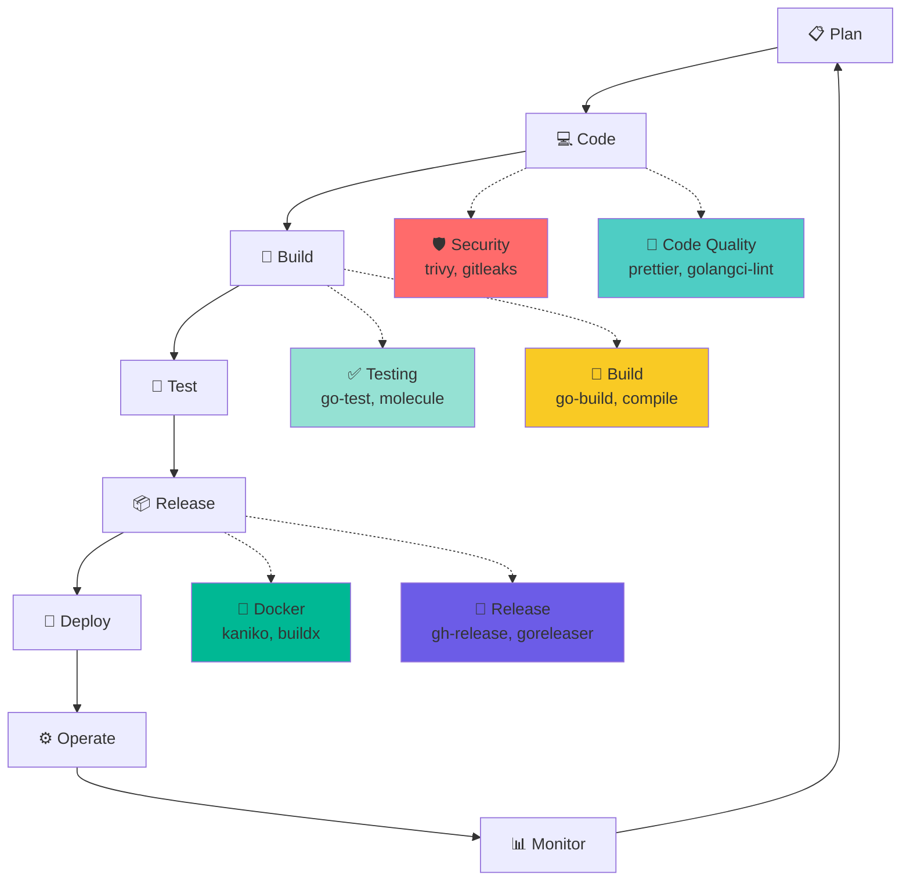
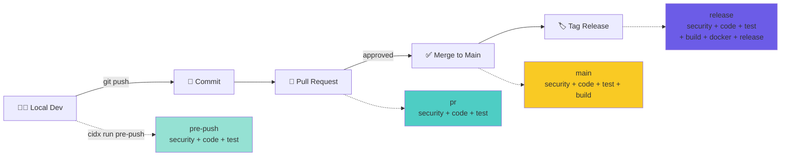
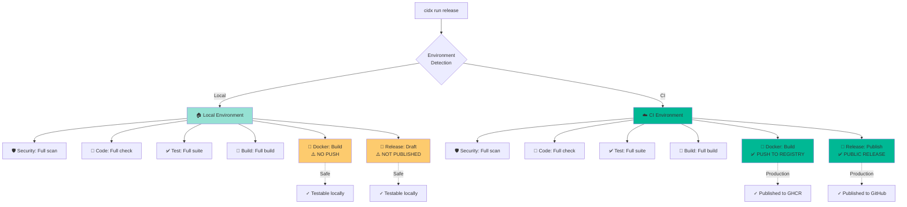
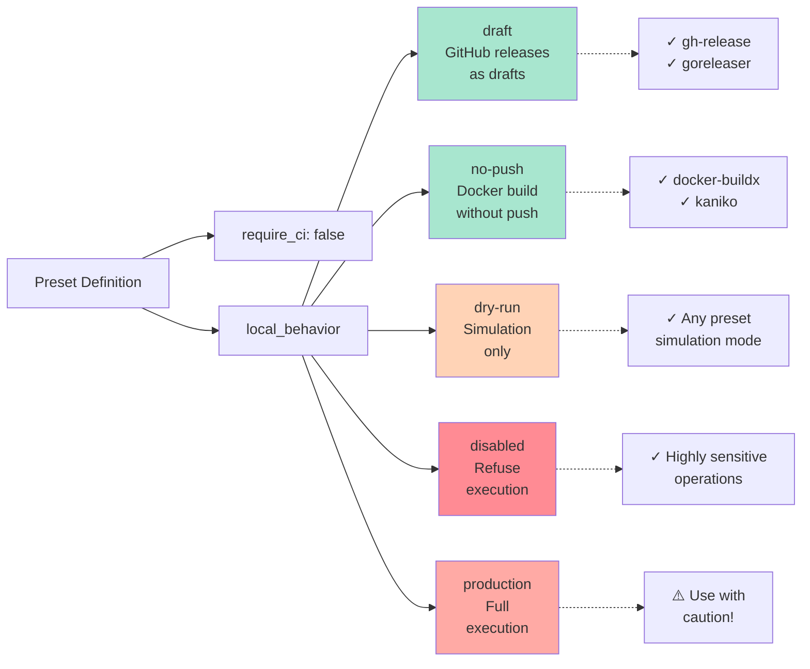
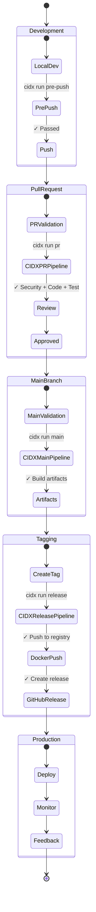
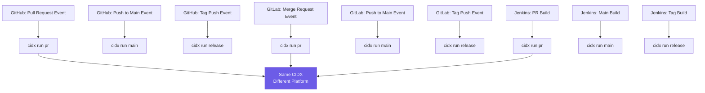

# CIDX & DevOps Integration

This document explains how CIDX integrates into standard DevOps workflows and product lifecycle.

## 1. CIDX in the DevOps Loop

## 2. Git Workflow & CIDX Pipelines

## 3. Environment-Based Execution

## 4. Security Modes Detail

## 5. Complete Product Lifecycle

## 6. CI/CD Platform Integration

## Key Principles

1. **Convention over Configuration**: CIDX knows what to do based on environment
2. **Safe by Default**: Sensitive operations protected in local environments
3. **Consistent Everywhere**: Same commands work on local, GitHub, GitLab, Jenkins
4. **Product Lifecycle Aware**: Different pipelines for different stages
5. **Testable Locally**: Full pipeline testable without publishing

## Benefits

- ✅ **Developers**: Test release process locally without risk
- ✅ **CI/CD**: Simplified configuration (just call CIDX)
- ✅ **Security**: Protected against accidental production publishes
- ✅ **Portability**: Switch CI platforms without changing CIDX config
- ✅ **Clarity**: Clear separation between development stages
